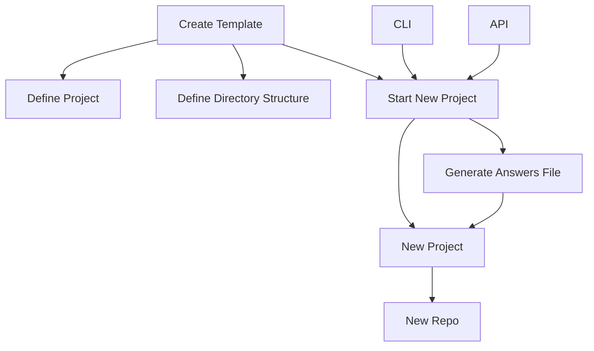

# Copier

- [Scaffold (programming): Wikipedia](https://en.wikipedia.org/wiki/Scaffold_(programming))

## Audience

- [x] Template Developer (A creator):
    - e.g. Intermediate Software Developer
    - e.g. Neuro-typed Software Developer
- [x] Template User (A consumer):
    - e.g. Beginner Software Developer
    - New Project Starters to focus on building codebases.

## Goals

1. Code scaffolding. Help consumers have a working source code tree as quickly as possible. All templates allow
   scaffolding.
2. Code lifecycle management. When the template evolves, let consumers update their projects. Not all templates
   allow updating.

# Implementers Guide:

## Quick Start

1. Base

```markdown
    📁 {{base}}
    ├── 📄 copier.yml
    ├── 📁 .git/
    ├── 📁 {{root}}
    │   └── 📄 {{code}}.py.jinja 
    ├── 📄 README.md
    └── 📄 {{_copier_conf.answers_file}}.jinja 
```

2. AsIs

```markdown
    📁 repo-root-template
    ├── 📁 .git/                                            # Template .git
    ├── 📁 .docs                                            # Template Docs
    │   ├── 📁 practices                                    # Best Practices
    │   │   ├── 📄 credits.md 
    │   ├── 📄 copier.md                                    # Copier Guide
    |   ├── 📄 notes.md                                     # A Markdown file
    │   └── 📄 .md  
    ├── 📁 {{project}}                                      # Target Project Template
    |   ├── 📄 {{code}}.py.jinja                            # A Code template
    │   └── 📄 {{_copier_conf.answers_file}}.jinja          # (Location 1)
    ├── 📄 copier.yml                                       # Copier Config
    ├── 📄 README.md                                        # Template Readme
    └── 📄 {{_copier_conf.answers_file}}.jinja              # (Location 2)
```

> Concept: Write a simple Repo template generator in markdown and using the above as an format: Purposes of: "To
> generate from sequence of inputs a directory structure to visualise a planned copier (or any other) directory
> structure."

## Steps

1. Create a Copier template repository topic level folder: `repo-root-template`
2. Create a `copier.yml` `template file: https://copier.readthedocs.io/en/stable/creating/
3. [ADR] Decide Project: as subfolder
4. Define the projects name as root of project (i.e. the subfolder)
5. Define the Projects's Sub-Directory Structure by
    - Defining the copier.yml questions
6. [ADR] Decide Usage: CLI vs. API

## Create Flow



## Configuring a Template

### Copier

> Includes things as minimal Copier version required, which subdirectory to render, tasks to run, etc

- Settings are defined in `_setting`.
- Some are only via CLI arguements.
- Some are only template configuration.

### Answers File

> Answers. This is customized per template.
> Answers are stored as variables available for the template at rendering time.

1. CLI or API.
2. Prompting the User.
3. Last execution.
4. Copier defaults.

### Questions
